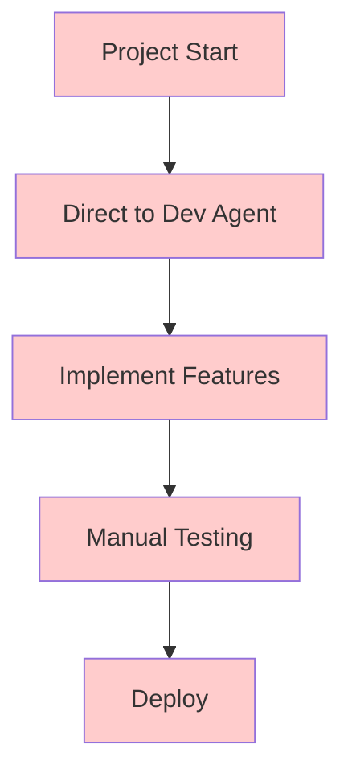
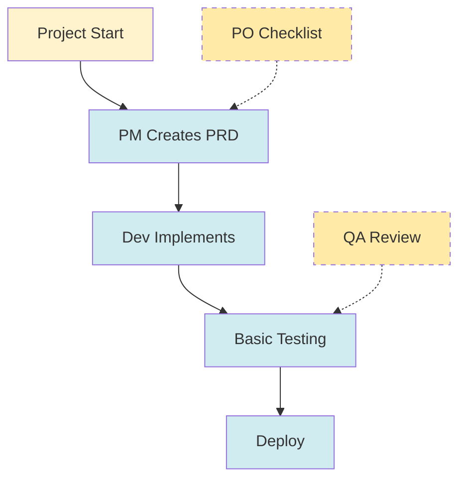
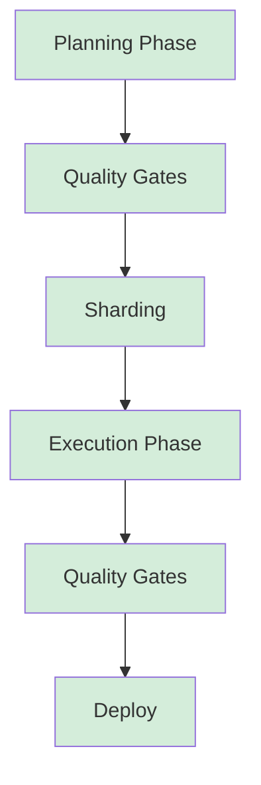
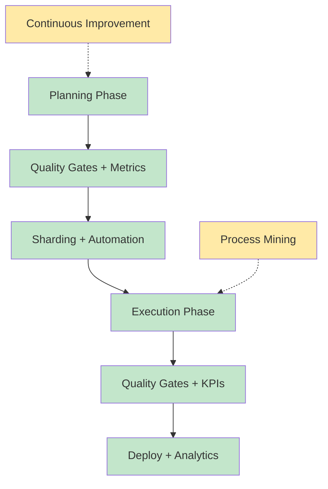
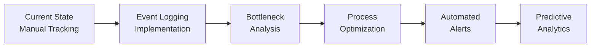
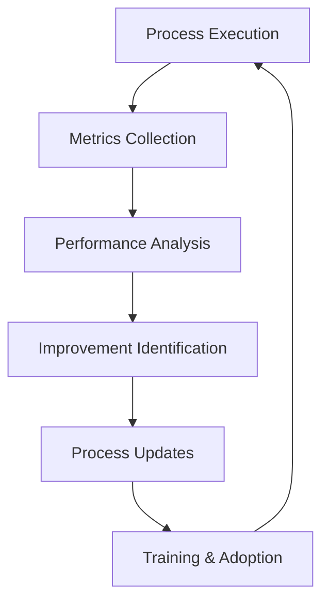

# BMAD Framework Process Model

## Process Mining Analysis of BMAD (Breakthrough Method of Agile AI-driven Development)

*Prepared by: Process Mining Expert*

---

## Table of Contents

1. [Overview](#overview)
2. [Process Map Diagram](#process-map-diagram)
3. [Bottlenecks and KPIs](#bottlenecks-and-kpis)
4. [Conformance Model](#conformance-model)
5. [Recommendations](#recommendations)

---

## Overview

This document presents a comprehensive process mining analysis of the BMAD framework, modeled as a business process using BPMN notation. The analysis covers:

- **Core Phases**: Planning and Execution
- **Key Activities**: PRD creation, architecture design, story development, QA validation
- **Roles/Agents**: Analyst, PM, Architect, Dev, QA, PO, SM
- **Artefact Handoffs**: PRD.md, Architecture.md, Story.md, QA reports
- **Quality Gates**: Checklist validation, DoD, PO approval
- **Rework Loops**: Fail → fix → re-check cycles
- **Start and End States**: Project initiation to deployment

The BMAD framework represents a sophisticated, AI-driven software development process with clear phases, specialized roles, and comprehensive quality gates.

---

## Process Map Diagram

### BPMN Process Flow

```mermaid
flowchart TD
    %% Start Event
    START([Project Initiation])

    %% Planning Phase
    subgraph P1[Planning Phase - Cost Effective (Gemini/Web UI)]
        A1[Analyst: Market Research<br/>Competitive Analysis]
        B1[PM: Create PRD<br/>create-doc task]
        C1[Architect: System Design<br/>create-doc task]
        D1[PO: Master Validation<br/>po-master-checklist]
        E1[Document Sharding<br/>shard-doc task]
    end

    %% Execution Phase
    subgraph P2[Execution Phase - IDE Implementation]
        F1[SM: Create Story<br/>create-next-story task]
        G1[PO: Story Approval<br/>validate-next-story task]
        H1[Dev: Implementation<br/>develop-story workflow]
        I1[QA: Pre-Implementation<br/>Risk Assessment<br/>Test Design<br/>Requirements Trace]
        J1[QA: Code Review<br/>review-story task]
        K1[QA: Quality Gate<br/>qa-gate decision]
    end

    %% Quality Gates and Decisions
    GATE1{PRD Valid?}
    GATE2{Architecture Valid?}
    GATE3{Story Approved?}
    GATE4{Quality Gate<br/>PASS/CONCERNS/FAIL?}

    %% Rework Loops
    REWORK1[PRD Revision<br/>PM fixes issues]
    REWORK2[Architecture Revision<br/>Architect fixes issues]
    REWORK3[Story Revision<br/>SM fixes issues]
    REWORK4[Code Revision<br/>Dev fixes issues]

    %% End Events
    SUCCESS([Story Complete<br/>Ready for Next])
    PROJECT_DONE([All Stories Done<br/>Project Complete])

    %% Flow Connections
    START --> A1

    A1 --> B1
    B1 --> GATE1
    GATE1 -->|PASS| C1
    GATE1 -->|FAIL| REWORK1
    REWORK1 --> B1

    C1 --> GATE2
    GATE2 -->|PASS| D1
    GATE2 -->|FAIL| REWORK2
    REWORK2 --> C1

    D1 --> E1
    E1 --> F1

    F1 --> GATE3
    GATE3 -->|APPROVED| H1
    GATE3 -->|REJECTED| REWORK3
    REWORK3 --> F1

    H1 --> I1
    I1 --> J1
    J1 --> GATE4

    GATE4 -->|PASS| SUCCESS
    GATE4 -->|CONCERNS<br/>WAIVED| SUCCESS
    GATE4 -->|FAIL| REWORK4
    REWORK4 --> H1

    SUCCESS --> F1
    SUCCESS -.->|All Stories<br/>Complete| PROJECT_DONE

    %% Styling
    classDef planningPhase fill:#e1f5fe,stroke:#01579b,stroke-width:2px
    classDef executionPhase fill:#f3e5f5,stroke:#4a148c,stroke-width:2px
    classDef qualityGate fill:#fff3e0,stroke:#e65100,stroke-width:3px
    classDef reworkLoop fill:#ffebee,stroke:#b71c1c,stroke-width:2px
    classDef endEvent fill:#e8f5e8,stroke:#2e7d32,stroke-width:2px

    class P1 planningPhase
    class P2 executionPhase
    class GATE1,GATE2,GATE3,GATE4 qualityGate
    class REWORK1,REWORK2,REWORK3,REWORK4 reworkLoop
    class SUCCESS,PROJECT_DONE endEvent
```

### Key Process Elements

#### Swimlanes (Roles/Agents)
- **Analyst**: Market research, requirements gathering
- **PM**: Product strategy, PRD creation
- **Architect**: Technical architecture, system design
- **PO**: Process validation, story approval
- **SM**: Story creation, agile process management
- **Dev**: Code implementation, debugging
- **QA**: Quality assurance, testing, gate decisions

#### Major Artefact Handoffs
1. **PRD.md** (PM → Architect)
2. **Architecture.md** (Architect → PO)
3. **Sharded Documents** (Planning → Execution)
4. **Story.md** (SM → PO)
5. **Approved Story** (PO → Dev)
6. **Implemented Code** (Dev → QA)
7. **QA Reports** (QA → Dev/PO)
8. **Quality Gate** (QA → Next Story)

#### Quality Gates
- **PRD Validation**: PO master checklist
- **Architecture Validation**: Architect checklist
- **Story Approval**: PO validation
- **Quality Gate**: QA assessment (PASS/CONCERNS/FAIL/WAIVED)

---

## Bottlenecks and KPIs

### Identified Bottlenecks

#### 1. Document Quality Gates (Critical)
**Location**: PO Master Checklist, PM Checklist, Architect Checklist
**Impact**: High - Can block entire project progression
**Duration**: 2-4 hours per validation
**Symptoms**:
- Accumulating technical debt
- Poor requirement clarity
- Architecture misalignment
- Development rework

#### 2. QA Review Process (Critical)
**Location**: review-story task with potential refactoring
**Impact**: High - Requires senior developer time
**Duration**: 4-8 hours per story
**Symptoms**:
- Code quality issues
- Testing gaps
- Security vulnerabilities
- Performance problems

#### 3. Story Approval Process (Medium)
**Location**: PO validation of story drafts
**Impact**: Medium - Can delay development start
**Duration**: 1-2 hours per story
**Symptoms**:
- Unclear requirements
- Missing acceptance criteria
- Technical feasibility issues

#### 4. Document Sharding (Medium-High)
**Location**: Transition from planning to execution
**Impact**: Medium-High - Critical handoff point
**Duration**: 30-60 minutes
**Symptoms**:
- Context loss
- SM effectiveness reduction
- Story creation delays

#### 5. Brownfield Analysis (High for Legacy)
**Location**: document-project task
**Impact**: High for brownfield projects
**Duration**: 4-8 hours
**Symptoms**:
- Poor integration understanding
- Breaking existing functionality
- Incomplete risk assessment

### Key Performance Indicators

#### Cycle Time Metrics

| Metric | Target | Current Range | Impact |
|--------|--------|----------------|---------|
| **Planning Phase** | < 3 days | 2-7 days | High |
| **Story Creation** | < 4 hours | 2-8 hours | Medium |
| **Development Cycle** | < 2 days | 1-5 days | High |
| **QA Review** | < 6 hours | 3-12 hours | High |
| **Quality Gate** | < 2 hours | 1-4 hours | Medium |

#### Quality Metrics

| Metric | Target | Description | Impact |
|--------|--------|-------------|---------|
| **Checklist Compliance** | > 90% | % of required checklists completed | Critical |
| **Rework Rate** | < 15% | % of work requiring revision | High |
| **Gate Pass Rate** | > 80% | % of quality gates passing first time | High |
| **Artefact Quality** | > 75% | Average quality score of deliverables | Medium |
| **Requirements Stability** | > 85% | % of requirements unchanged after approval | High |

#### Throughput Metrics

| Metric | Target | Description |
|--------|--------|-------------|
| **Stories per Week** | 3-5 | Sustainable development velocity |
| **Planning Efficiency** | > 70% | % of planning time spent on value activities |
| **QA Coverage** | > 90% | % of code/test scenarios covered |
| **Agent Utilization** | > 80% | % of agent capacity used effectively |

#### Process Efficiency Metrics

| Metric | Target | Description |
|--------|--------|-------------|
| **Agent Specialization** | > 85% | % of work done by appropriate specialist |
| **Artefact Reuse** | > 70% | % of artefacts used across multiple stories |
| **Automation Coverage** | > 60% | % of repetitive tasks automated |
| **Context Switching** | < 20% | % of time spent on context switching |

### Bottleneck Mitigation Strategies

#### Immediate Actions
1. **Parallel Processing**: Risk assessment and test design can run concurrently
2. **Template Standardization**: Pre-built templates reduce creation time
3. **Checklist Automation**: Basic validation rules can be automated
4. **Agent Training**: Improve specialist effectiveness

#### Medium-term Improvements
1. **Process Mining Implementation**: Track bottlenecks systematically
2. **Quality Gate Optimization**: Streamline validation processes
3. **Artefact Management**: Better document lifecycle management
4. **Feedback Loop Integration**: Continuous process improvement

---

## Conformance Model

### Maturity Levels Framework

#### Level 1: Foundation (Basic Adoption)


**Characteristics:**
- Bypasses all planning and quality gates
- No structured documentation
- Ad-hoc development approach
- **Risk**: High failure rate, technical debt accumulation

#### Level 2: Structured (Partial Adoption)


**Characteristics:**
- Some documentation created
- Inconsistent quality gates
- Selective checklist usage
- **Risk**: Inconsistent quality, partial coverage

#### Level 3: Compliant (Full Adoption)


**Characteristics:**
- All quality gates implemented
- Comprehensive documentation
- Full agent collaboration
- **Benefit**: Predictable quality, reduced rework

#### Level 4: Optimized (Advanced Adoption)


**Characteristics:**
- Metrics-driven optimization
- Automated quality checks
- Continuous process improvement
- **Benefit**: Maximum efficiency, data-driven decisions

### Process Deviations & Impacts

#### Deviation Analysis Matrix

| Deviation | Quality Impact | Timeline Impact | Risk Increase | Recovery Effort |
|-----------|----------------|-----------------|---------------|-----------------|
| **Skip Planning** | -40% | +45% | +60% | Full planning restart |
| **Bypass QA Gates** | -35% | +30% | +55% | Complete QA cycle |
| **Incomplete QA** | -50% | +25% | +70% | Production fixes |
| **Agent Confusion** | -30% | +20% | +25% | Role reassignment |
| **Skip Sharding** | -60% | +80% | +45% | Context rebuilding |

#### Critical Process Violations

1. **Planning Phase Bypass**
   ```
   Ideal: Analyst → PM → Architect → PO → Shard → Execution
   Violation: Direct SM/Dev without planning
   Impact: Poor requirements, high rework, timeline delays
   ```

2. **Quality Gate Skipping**
   ```
   Ideal: Comprehensive checklist validation
   Violation: Direct approval without validation
   Impact: Quality issues, development defects, team frustration
   ```

3. **Agent Role Confusion**
   ```
   Ideal: Specialized agents with domain expertise
   Violation: Using bmad-master for all tasks
   Impact: Lower quality outputs, inefficient context usage
   ```

### Process Mining Implementation

#### Event Log Structure
```json
{
  "case_id": "project-2024-001",
  "activity": "create-prd",
  "agent": "pm",
  "timestamp": "2024-01-15T10:30:00Z",
  "artefact": "docs/prd.md",
  "quality_score": 85,
  "duration_ms": 3600000,
  "compliance_level": "full"
}
```

#### Key Process Mining Queries
```sql
-- Identify bottlenecks
SELECT activity, AVG(duration_ms) as avg_duration
FROM event_log
WHERE phase = 'planning'
GROUP BY activity
ORDER BY avg_duration DESC;

-- Track conformance
SELECT
  case_id,
  AVG(CASE WHEN compliance_level = 'full' THEN 1 ELSE 0 END) as conformance_rate
FROM event_log
GROUP BY case_id;

-- Rework pattern analysis
SELECT
  case_id,
  COUNT(*) as rework_count,
  AVG(quality_score) as avg_quality
FROM event_log
WHERE activity LIKE '%rework%' OR activity LIKE '%fix%'
GROUP BY case_id;
```

### Conformance Scoring Framework

#### Process Compliance Score (PCS)
```
PCS = (Completed Gates / Total Gates) × (Quality Standards Met / Total Standards) × 100

Target Levels:
- Level 1: < 30% (Foundation)
- Level 2: 30-60% (Structured)
- Level 3: 60-85% (Compliant)
- Level 4: > 85% (Optimized)
```

#### Quality Impact Assessment
```yaml
conformance_impact:
  level_3_plus:    # Full compliance
    quality_boost: "+40%"
    timeline_reduction: "-25%"
    defect_reduction: "-60%"
    predictability: "High"

  level_2:         # Partial compliance
    quality_boost: "+15%"
    timeline_reduction: "-10%"
    defect_reduction: "-25%"
    predictability: "Medium"

  level_1:         # Basic compliance
    quality_boost: "0%"
    timeline_reduction: "+10%"
    defect_reduction: "-5%"
    predictability: "Low"
```

---

## Recommendations

### Process Optimization Priorities

#### 1. **Parallel Processing Opportunities**
- Risk assessment and test design can run concurrently with development
- PO validation can overlap with initial development setup
- QA preparation tasks can begin before code completion

#### 2. **Automation Candidates**
- Document sharding process (partially automated)
- Basic checklist validation rules
- Quality gate status calculation
- Artefact handoff notifications
- Template instantiation

#### 3. **Process Mining Roadmap**


#### 4. **Quality Gate Optimization**
- Streamline checklist processes
- Implement progressive validation
- Add automated checks for basic compliance
- Create checklist templates for common scenarios

### Key Success Factors

#### Process Discipline
1. **Complete Planning Phase** - Foundation for quality execution
2. **Rigorous Quality Gates** - Prevent defects at source
3. **Agent Specialization** - Leverage domain expertise effectively
4. **Comprehensive Documentation** - Enable AI agent effectiveness
5. **Consistent Process Adherence** - Framework effectiveness depends on execution

#### Critical Success Metrics
- **Checklist Compliance**: > 90%
- **Rework Rate**: < 15%
- **Quality Gate Pass Rate**: > 80%
- **Planning Phase Completion**: < 3 days
- **Story Development Cycle**: < 2 days

### Risk Mitigation Strategies

#### For High-Risk Projects
1. **Enhanced Planning Phase** - Add extra validation cycles
2. **Parallel QA Preparation** - Begin risk assessment early
3. **Senior Oversight** - Include experienced team members in gates
4. **Incremental Delivery** - Smaller stories with more frequent validation

#### For Brownfield Projects
1. **Extended Analysis Phase** - Comprehensive document-project execution
2. **Integration Testing Focus** - Additional QA cycles for compatibility
3. **Rollback Planning** - Detailed recovery procedures
4. **Change Impact Analysis** - Thorough assessment of existing system effects

### Continuous Improvement Framework

#### Feedback Loop Integration


#### Key Improvement Areas
1. **Template Optimization** - Refine based on usage patterns
2. **Checklist Streamlining** - Remove redundant validations
3. **Agent Training** - Improve specialist effectiveness
4. **Tool Integration** - Better IDE and AI tool integration
5. **Process Automation** - Identify and implement automation opportunities

---

## Conclusion

The BMAD framework represents a sophisticated, AI-driven software development process with clear phases, specialized roles, and comprehensive quality gates. The conformance model reveals that while the framework provides excellent structure for high-quality development, its effectiveness depends heavily on disciplined execution of all quality gates and proper agent utilization.

**Critical Success Factors:**
1. **Complete Planning Phase** - Foundation for quality execution
2. **Rigorous Quality Gates** - Prevent defects early
3. **Agent Specialization** - Leverage domain expertise
4. **Comprehensive Documentation** - Enable AI agent effectiveness
5. **Process Discipline** - Follow the framework consistently

**Key Performance Indicators to Track:**
- Checklist compliance rate
- Rework frequency and duration
- Quality gate pass rates
- Planning vs. execution phase durations
- Agent utilization efficiency

The framework's strength lies in its systematic approach to managing complexity in AI-assisted development, with built-in quality controls and clear accountability for each phase of the development lifecycle.

---

*Document Version: 1.0*
*Last Updated: 2025-01-17*
*Analysis Based on: BMAD Core Framework v4.43.1*

