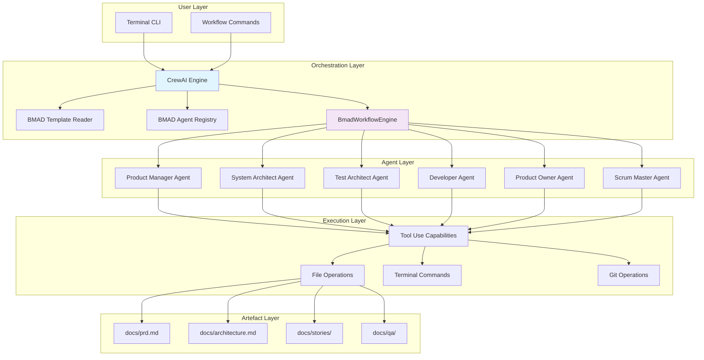

# BMAD CrewAI Integration Architecture Document

## Introduction

This document outlines the complete backend architecture for BMAD CrewAI Integration, focusing on the CrewAI orchestration layer and BMAD agent coordination. It serves as the single source of truth for AI-driven development, ensuring consistency in the terminal-based workflow execution.

This focused approach emphasizes the core orchestration capabilities where CrewAI reads BMAD templates and coordinates specialized agents to generate artefacts following BMAD folder structure conventions.

### Starter Template or Existing Project

Based on the project structure, this appears to be a greenfield Python package project with no starter templates or existing codebases being extended. The project follows a standard Python package structure with src/ layout, which is appropriate for a library package that will be distributed via PyPI.

**Decision:** N/A - Greenfield Python package project

### Change Log

| Date | Version | Description | Author |
|------|---------|-------------|--------|
| 2025-01-17 | 1.0 | Initial architecture document creation | Winston (Architect)
| 2025-01-17 | 1.1 | Enhanced with fullstack architecture template | Winston (Architect)

## High Level Architecture

### Technical Summary

The BMAD CrewAI Integration implements a sophisticated orchestration architecture where CrewAI serves as the primary workflow engine that reads BMAD templates and coordinates specialized BMAD agents to generate artefacts in the BMAD folder structure. This terminal-first Python package provides a structured bridge between CrewAI's multi-agent capabilities and BMAD-Method's proven development processes, enabling solo developers and small teams to achieve 3x productivity improvements through coordinated AI workflows.

The architecture achieves the PRD goals by establishing a single-source contract where all templates, checklists, and gate rules reside in the BMAD repository, while CrewAI acts purely as an orchestration and artefact generation layer.

### Platform and Infrastructure Choice

**Primary Platform:** Local Development Environment (Terminal-First)
- **Rationale:** MVP focuses on solo developers and small teams working locally
- **Key Services:** File system operations, terminal command execution, Git integration
- **Deployment:** Python package (pip installable) with local artefact generation
- **Infrastructure:** No cloud dependencies - runs entirely on developer machines

**Secondary Platform:** Cross-Platform Support
- **Operating Systems:** macOS (primary), Linux (secondary), Windows (support)
- **Runtime:** Python 3.8+ with CrewAI v0.1.0+ compatibility
- **Storage:** Local file system for BMAD artefact generation

### AI Model Configuration

**Primary AI Provider:** OpenRouter API
- **Models:** `openrouter/sonoma-sky-alpha` (primary), `openrouter/sonoma-dusk-alpha` (backup)
- **Rationale:** Free models reduce operational costs while maintaining quality
- **Configuration:** Environment variables (`OPENROUTER_API_KEY`, `OPENROUTER_MODEL`)

**Fallback Provider:** OpenAI API
- **Models:** `gpt-4` (fallback when OpenRouter unavailable)
- **Configuration:** Environment variable (`API_OPENAI_KEY`)
- **Purpose:** Ensures system reliability when primary models are unavailable

**Model Selection Logic:**
1. Try OpenRouter primary model (`sonoma-sky-alpha`)
2. If unavailable, try OpenRouter backup model (`sonoma-dusk-alpha`)
3. If both fail, fallback to OpenAI GPT-4
4. If all fail, use CrewAI defaults

### Repository Structure

**Structure:** Monorepo
- **Tool:** Native Python packaging (setuptools/hatchling) with workspace management
- **Rationale:** Tight coupling between CrewAI orchestration and BMAD framework components
- **Package Organization:** Core package with modular agent implementations
- **Shared Code:** Common utilities and BMAD integration patterns

### High Level Architecture Diagram



### Architectural Patterns

- **Orchestration Pattern:** CrewAI as primary workflow engine coordinating BMAD agents
- **Template-Driven Architecture:** BMAD YAML templates drive all workflow execution
- **Artefact Generation Pattern:** Agents write outputs to BMAD folder structure
- **Quality Gate Pattern:** Built-in PASS/CONCERNS/FAIL validation throughout workflow
- **Single-Source Contract Pattern:** BMAD repository contains all templates/rules, CrewAI reads and writes artefacts

## Core Architecture Principles

### Orchestration Strategy
- **CrewAI as Primary Orchestrator**: CrewAI serves as the main workflow engine and coordination layer
- **BMAD Template Consumption**: CrewAI reads and interprets BMAD YAML templates to understand workflow requirements
- **Agent Coordination**: CrewAI orchestrates execution of BMAD specialized agents in proper sequence
- **Artefact Management**: All outputs written to BMAD folder structure following framework conventions
- **Process Integrity**: CrewAI maintains BMAD methodology execution flow and enforces quality gates

### Integration Pattern
```
┌─────────────────┐    ┌─────────────────┐    ┌─────────────────┐
│     CrewAI      │────│   BMAD Framework│────│   File System   │
│  Orchestrator   │    │                 │    │                 │
│                 │    │ • Templates     │    │ • docs/         │
│ • Workflow      │    │ • Agents        │    │ • stories/      │
│ • Coordination  │    │ • Quality Gates │    │ • qa/           │
│ • Validation    │    │ • Folder Struct │    │ • etc.          │
└─────────────────┘    └─────────────────┘    └─────────────────┘
         │                       │                       │
         └─Loads BMAD templates   └─Provides agents &   └─Writes artefacts
           from .bmad-core/      patterns               to BMAD folders
```

## Component Architecture

### CrewAI Orchestration Layer

#### Template Reader
```python
class BmadTemplateReader:
    """Loads and parses BMAD YAML templates"""

    def load_template(self, template_path: str) -> dict:
        """Load BMAD template from .bmad-core/templates/"""
        pass

    def validate_template(self, template: dict) -> bool:
        """Validate template structure and required fields"""
        pass

    def extract_workflow_sequence(self, template: dict) -> list:
        """Extract agent execution sequence from template"""
        pass
```

#### Agent Registry
```python
class BmadAgentRegistry:
    """Manages BMAD agent registration with CrewAI"""

    def register_agents(self) -> dict:
        """Register all BMAD agents as CrewAI tools"""
        return {
            'pm': ProductManager(),
            'architect': SystemArchitect(),
            'qa': TestArchitect(),
            'dev': Developer(),
            'po': ProductOwner(),
            'sm': ScrumMaster()
        }

    def get_agent_capabilities(self, agent_id: str) -> list:
        """Get agent capabilities for task assignment"""
        pass
```

#### Workflow Engine
```python
class BmadWorkflowEngine:
    """Manages BMAD workflow execution sequence"""

    def __init__(self, crew: Crew, template_reader: BmadTemplateReader):
        self.crew = crew
        self.template_reader = template_reader

    def execute_workflow(self, workflow_template: str):
        """Execute complete BMAD workflow"""
        # Load template
        template = self.template_reader.load_template(workflow_template)

        # Register agents
        agents = BmadAgentRegistry().register_agents()

        # Execute workflow sequence
        for step in template['workflow_sequence']:
            agent = agents[step['agent']]
            task = self.create_task_from_step(step)
            result = self.crew.execute_task(agent, task)

            # Write artefact to BMAD folder
            self.write_artefact_to_bmad_folder(result, step['output_path'])

        # Enforce quality gates
        self.validate_quality_gates(template['quality_gates'])
```

#### Artefact Writer
```python
class BmadArtefactWriter:
    """Handles writing artefacts to BMAD folder structure"""

    FOLDER_MAPPING = {
        'prd': 'docs/prd.md',
        'architecture': 'docs/architecture.md',
        'stories': 'docs/stories/',
        'qa_assessments': 'docs/qa/assessments/',
        'qa_gates': 'docs/qa/gates/'
    }

    def write_artefact(self, content: str, artefact_type: str, filename: str):
        """Write artefact to appropriate BMAD folder"""
        base_path = self.FOLDER_MAPPING[artefact_type]
        full_path = f"{base_path}/{filename}"

        # Ensure directory exists
        os.makedirs(os.path.dirname(full_path), exist_ok=True)

        # Write artefact
        with open(full_path, 'w') as f:
            f.write(content)

    def validate_folder_structure(self):
        """Ensure BMAD folder structure exists"""
        for folder in self.FOLDER_MAPPING.values():
            if folder.endswith('/'):
                os.makedirs(folder, exist_ok=True)
```

#### Quality Gate Manager
```python
class BmadQualityGateManager:
    """Enforces BMAD quality gates through CrewAI"""

    def __init__(self, crew: Crew):
        self.crew = crew

    def validate_gate(self, gate_definition: dict) -> dict:
        """Execute quality gate validation"""
        # Create validation tasks
        validation_tasks = self.create_validation_tasks(gate_definition)

        # Execute validation
        results = {}
        for task in validation_tasks:
            result = self.crew.execute_task(task['agent'], task['definition'])
            results[task['name']] = self.interpret_validation_result(result)

        return {
            'status': self.determine_overall_status(results),
            'results': results,
            'recommendations': self.generate_recommendations(results)
        }

    def determine_overall_status(self, results: dict) -> str:
        """Determine PASS/CONCERNS/FAIL status"""
        if any(result['severity'] == 'high' for result in results.values()):
            return 'FAIL'
        elif any(result['severity'] == 'medium' for result in results.values()):
            return 'CONCERNS'
        else:
            return 'PASS'
```

### BMAD Framework Layer

#### Template System
```yaml
# Example BMAD Template Structure
template_version: "1.0"
workflow_name: "greenfield-fullstack"

agents:
  pm:
    role: "Product Manager"
    capabilities: ["create-prd", "validate-requirements"]
    output_folder: "docs/"

  architect:
    role: "System Architect"
    capabilities: ["create-architecture", "design-system"]
    output_folder: "docs/"

  qa:
    role: "Test Architect"
    capabilities: ["risk-assessment", "test-design", "review"]
    output_folder: "docs/qa/"

workflow_sequence:
  - step: 1
    agent: "pm"
    task: "create-prd"
    template: "prd-tmpl.yaml"
    output_path: "docs/prd.md"
    quality_gate: "document-validation"

  - step: 2
    agent: "architect"
    task: "create-architecture"
    template: "fullstack-architecture-tmpl.yaml"
    output_path: "docs/architecture.md"
    dependencies: [1]
    quality_gate: "architecture-validation"

quality_gates:
  document-validation:
    type: "content-validation"
    criteria: ["completeness", "clarity", "consistency"]

  architecture-validation:
    type: "technical-validation"
    criteria: ["feasibility", "scalability", "security"]
```

#### Agent Specializations

##### Product Manager Agent
```python
class ProductManager:
    """BMAD Product Manager specialized agent"""

    def create_prd(self, requirements: dict) -> str:
        """Create Product Requirements Document"""
        # Load PRD template
        template = self.load_template('prd-tmpl.yaml')

        # Generate PRD content
        prd_content = self.generate_prd_content(requirements, template)

        # Return formatted PRD
        return self.format_prd_output(prd_content)

    def validate_requirements(self, prd_content: str) -> dict:
        """Validate PRD against quality criteria"""
        return self.perform_validation_checks(prd_content)
```

##### System Architect Agent
```python
class SystemArchitect:
    """BMAD System Architect specialized agent"""

    def create_architecture(self, prd_content: str) -> str:
        """Create system architecture document"""
        # Analyze PRD requirements
        requirements = self.analyze_prd_requirements(prd_content)

        # Design system architecture
        architecture = self.design_system_architecture(requirements)

        # Generate architecture document
        return self.generate_architecture_document(architecture)

    def validate_technical_feasibility(self, architecture: str) -> dict:
        """Validate technical feasibility"""
        return self.perform_technical_validation(architecture)
```

## Data Flow Architecture

### Input Processing
1. **Template Loading**: CrewAI loads BMAD YAML templates
2. **Requirement Parsing**: Extract workflow sequence and agent assignments
3. **Context Preparation**: Gather necessary context for agent execution
4. **Validation Setup**: Configure quality gates and validation criteria

### Agent Execution Flow
1. **Agent Selection**: CrewAI selects appropriate BMAD agent for task
2. **Task Execution**: Agent performs specialized task with domain expertise
3. **Output Generation**: Agent produces artefact following BMAD conventions
4. **Quality Validation**: Built-in validation checks artefact quality
5. **Artefact Storage**: Output written to BMAD folder structure

### Output Management
1. **File System Integration**: Artefacts written to correct BMAD folders
2. **Naming Conventions**: Files follow BMAD naming patterns
3. **Metadata Tracking**: Track artefact creation and modification
4. **Version Control**: Integration with git for artefact versioning

## Quality Assurance Integration

### Template Validation
- **Syntax Validation**: Ensure YAML templates are well-formed
- **Schema Compliance**: Validate against BMAD template schema
- **Dependency Resolution**: Check template dependencies are satisfied
- **Security Scanning**: Validate templates don't contain security issues

### Runtime Validation
- **Agent Health Checks**: Ensure BMAD agents are functioning correctly
- **Output Validation**: Verify artefacts meet quality standards
- **Process Adherence**: Confirm workflow execution follows BMAD methodology
- **Error Handling**: Proper error recovery and reporting

### Quality Gates
- **Pre-execution Gates**: Validate inputs and prerequisites
- **In-flight Gates**: Monitor execution quality and progress
- **Post-execution Gates**: Comprehensive artefact validation
- **Exit Gates**: Final approval before workflow completion

## Integration Patterns

### CrewAI to BMAD Agent Communication
```python
# Example integration pattern
from crewai import Crew, Task, Agent
from bmad_agents import ProductManager, SystemArchitect

# Initialize CrewAI crew
crew = Crew(
    agents=[
        Agent(
            role="Product Manager",
            goal="Create comprehensive product requirements",
            backstory="Expert in product strategy and requirements gathering",
            tools=[ProductManager()]
        ),
        Agent(
            role="System Architect",
            goal="Design scalable system architecture",
            backstory="Expert in system design and technical architecture",
            tools=[SystemArchitect()]
        )
    ]
)

# Load BMAD workflow
workflow = load_bmad_workflow('greenfield-fullstack.yaml')

# Execute workflow
result = crew.kickoff(workflow)
```

### Artefact Writing Pattern
```python
# Example artefact writing
from bmad_crewai import BmadArtefactWriter

writer = BmadArtefactWriter()

# Write PRD artefact
writer.write_artefact(
    content=prd_content,
    artefact_type='prd',
    filename='prd.md'
)

# Write story artefact
writer.write_artefact(
    content=story_content,
    artefact_type='stories',
    filename='1.1-user-authentication.md'
)
```

## Deployment Architecture

### Local Development
- **Standalone Mode**: CrewAI orchestrates BMAD agents locally
- **File System Access**: Direct access to BMAD folder structure
- **Template Loading**: Load templates from local .bmad-core directory
- **Artefact Storage**: Write to local docs/, stories/, qa/ directories

### Containerized Deployment
- **Docker Integration**: Containerized CrewAI + BMAD environment
- **Volume Mounting**: Mount BMAD folder structure into container
- **Template Access**: Access to .bmad-core/templates via volume mount
- **Artefact Persistence**: Persistent volume for generated artefacts

### Local Development Integration
- **File System API**: Direct file system access for artefact generation
- **Local Storage**: Local file system storage for generated artefacts
- **Template Management**: Local template storage and validation
- **Process Monitoring**: Local workflow execution monitoring and logging

## Security Considerations

### Template Security
- **Template Validation**: Validate templates before execution
- **Access Control**: Control who can create/modify templates
- **Audit Logging**: Log all template access and modifications
- **Code Injection Prevention**: Sanitize dynamic template content

### Artefact Security
- **File System Permissions**: Proper permissions on BMAD folders
- **Content Validation**: Validate artefact content before writing
- **Encryption**: Encrypt sensitive artefacts at rest
- **Access Logging**: Log all artefact access and modifications

### Agent Security
- **Agent Isolation**: Isolate BMAD agents from each other
- **Resource Limits**: Prevent resource exhaustion attacks
- **Input Validation**: Validate all inputs to agents
- **Output Sanitization**: Sanitize agent outputs before storage

## Performance Optimization

### Caching Strategies
- **Template Caching**: Cache parsed BMAD templates
- **Agent State**: Cache agent initialization state
- **Artefact Metadata**: Cache artefact metadata for faster access
- **Validation Results**: Cache validation results when appropriate

### Parallel Execution
- **Independent Tasks**: Execute independent workflow steps in parallel
- **Agent Pooling**: Maintain pool of initialized agents
- **Batch Processing**: Process multiple artefacts simultaneously
- **Async Operations**: Use async patterns for I/O operations

### Resource Management
- **Memory Optimization**: Efficient memory usage for large artefacts
- **Disk I/O**: Optimize file system operations
- **Network Efficiency**: Minimize network calls in local deployments
- **CPU Utilization**: Balance CPU usage across agents

## Monitoring and Observability

### Logging
- **Execution Logs**: Log workflow execution steps
- **Agent Activity**: Log agent actions and decisions
- **Artefact Changes**: Log all artefact modifications
- **Error Tracking**: Comprehensive error logging and tracking

### Metrics
- **Performance Metrics**: Execution time, resource usage
- **Quality Metrics**: Pass/fail rates for quality gates
- **Artefact Metrics**: Size, complexity, validation scores
- **Agent Metrics**: Success rates, error rates, utilization

### Alerting
- **Quality Gate Failures**: Alert on failed validations
- **Performance Issues**: Alert on slow execution or high resource usage
- **Agent Failures**: Alert on agent execution errors
- **Artefact Issues**: Alert on invalid or corrupted artefacts

## MVP Scope & Boundaries

### Core MVP Functionality
- **CrewAI Orchestration**: Basic workflow coordination
- **BMAD Agent Integration**: 6 core agents (PM, Architect, QA, Dev, PO, SM)
- **Template Processing**: YAML template loading and validation
- **Artefact Generation**: Basic document and code artefact creation
- **Quality Gates**: Simple PASS/FAIL validation
- **CLI Interface**: Terminal-based workflow execution

### Explicitly Out of Scope for MVP
- **Advanced Analytics**: No detailed reporting or dashboards
- **Multi-User Collaboration**: Single-user terminal focus
- **Plugin Ecosystem**: No third-party extensions
- **Enterprise Features**: No governance, audit trails, multi-tenancy
- **Advanced Orchestration**: No dynamic workflows or complex branching
- **Performance Monitoring**: No detailed metrics collection

### Success Criteria Alignment
- **Setup Time**: < 30 minutes (architecture supports this)
- **Workflow Completion**: End-to-end development workflow (core functionality)
- **Artefact Quality**: Professional-quality outputs (basic validation ensures this)
- **Performance**: 2-3 days vs 1-2 weeks manual (streamlined architecture)

## BMAD Integration (MVP Focus)

The architecture provides essential BMAD integration for MVP functionality:

### Core Process Support
- **Template Loading**: Read BMAD YAML templates from .bmad-core/
- **Agent Coordination**: Basic workflow orchestration between agents
- **Artefact Generation**: Create documents in BMAD folder structure
- **Quality Validation**: Simple validation of generated artefacts

### Agent Integration
- **6 Core Agents**: PM, Architect, QA, Dev, PO, SM
- **Basic Coordination**: Sequential task execution
- **Artefact Handoff**: Simple document passing between agents
- **Error Handling**: Basic failure recovery and reporting

### Simplified Quality Assurance

**Basic Quality Gates:**
- **PASS**: Requirements met, no critical issues
- **FAIL**: Critical issues prevent release
- **Simple validation**: Template syntax, artefact completeness, basic consistency

**MVP Quality Focus:**
- Template validation before execution
- Artefact generation verification
- Basic error handling and recovery

## MVP Testing Approach

### Basic Testing Strategy

**Unit Testing:**
- Core orchestration logic
- Template parsing and validation
- Basic agent coordination
- Target: 60-70% coverage for MVP

**Integration Testing:**
- CrewAI + BMAD template interaction
- Artefact generation workflow
- Basic tool use capabilities

**Simple Quality Gates:**
- **PASS**: Template loads, agents execute, artefacts generated
- **FAIL**: Critical errors prevent basic functionality

### Testing Infrastructure (MVP)

**Directory Structure:**
```
docs/qa/
├── gates/                # Simple quality gate decisions
│   └── {epic}.{story}-{slug}.yml
└── basic-checks/         # Basic validation results
    └── {epic}.{story}-checks.md
```

**Gate File (Simplified):**
```yaml
schema: 1
story: "1.1"
gate: PASS|FAIL
status: "Template validation passed, artefacts generated successfully"
reviewer: "Basic QA"
updated: "2025-01-17T10:30:00Z"
```
