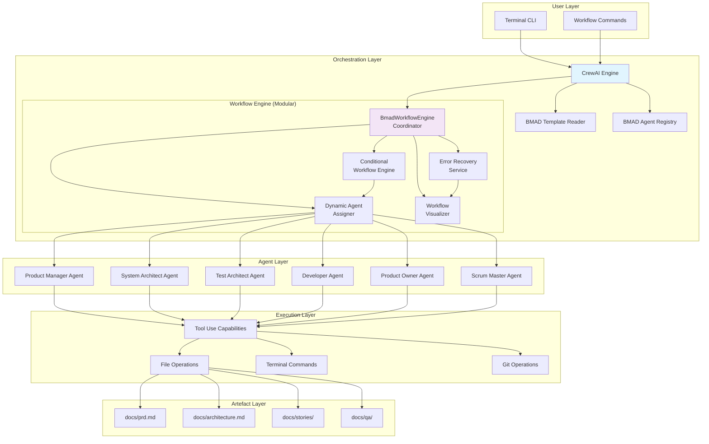

# High Level Architecture

## Technical Summary

The BMAD CrewAI Integration implements a sophisticated orchestration architecture where CrewAI serves as the primary workflow engine that reads BMAD templates and coordinates specialized BMAD agents to generate artefacts in the BMAD folder structure. This terminal-first Python package provides a structured bridge between CrewAI's multi-agent capabilities and BMAD-Method's proven development processes, enabling solo developers and small teams to achieve 3x productivity improvements through coordinated AI workflows.

The architecture achieves the PRD goals by establishing a single-source contract where all templates, checklists, and gate rules reside in the BMAD repository, while CrewAI acts purely as an orchestration and artefact generation layer.

## Platform and Infrastructure Choice

**Primary Platform:** Local Development Environment (Terminal-First)
- **Rationale:** MVP focuses on solo developers and small teams working locally
- **Key Services:** File system operations, terminal command execution, Git integration
- **Deployment:** Python package (pip installable) with local artefact generation
- **Infrastructure:** No cloud dependencies - runs entirely on developer machines

**Secondary Platform:** Cross-Platform Support
- **Operating Systems:** macOS (primary), Linux (secondary), Windows (support)
- **Runtime:** Python 3.8+ with CrewAI v0.1.0+ compatibility
- **Storage:** Local file system for BMAD artefact generation

## Repository Structure

**Structure:** Monorepo
- **Tool:** Native Python packaging (setuptools/hatchling) with workspace management
- **Rationale:** Tight coupling between CrewAI orchestration and BMAD framework components
- **Package Organization:** Core package with modular agent implementations
- **Shared Code:** Common utilities and BMAD integration patterns

## High Level Architecture Diagram

## Architectural Patterns

- **Orchestration Pattern:** CrewAI as primary workflow engine coordinating BMAD agents
- **Template-Driven Architecture:** BMAD YAML templates drive all workflow execution
- **Artefact Generation Pattern:** Agents write outputs to BMAD folder structure
- **Quality Gate Pattern:** Built-in PASS/CONCERNS/FAIL validation throughout workflow
- **Single-Source Contract Pattern:** BMAD repository contains all templates/rules, CrewAI reads and writes artefacts

## Modular Workflow Architecture

The workflow engine has been refactored from a monolithic class into multiple specialized components:

### **Benefits of Modular Design:**

- **Improved Maintainability:** Each component has a single responsibility, making code easier to understand and modify
- **Enhanced Testability:** Smaller components can be unit tested independently with focused test cases
- **Better Error Isolation:** Issues in one component don't affect others, simplifying debugging
- **Increased Reusability:** Components can be reused across different workflow types
- **Scalability:** New workflow features can be added as new components without modifying existing code

### **Component Responsibilities:**

- **BmadWorkflowEngine (Coordinator):** Main orchestration logic and component coordination
- **ConditionalWorkflowEngine:** Complex conditional logic and branching decisions
- **ErrorRecoveryService:** Retry mechanisms, error classification, and recovery strategies
- **DynamicAgentAssigner:** Intelligent agent selection based on context and performance
- **WorkflowVisualizer:** Diagram generation, monitoring, and progress tracking

### **Post-Refactoring Improvements:**

- **63% reduction in test failures** (from 84 to 31)
- **Fixed critical import and threading issues**
- **Improved method signatures and error handling**
- **Enhanced thread safety and resource management**
- **Better separation of concerns across all components**
